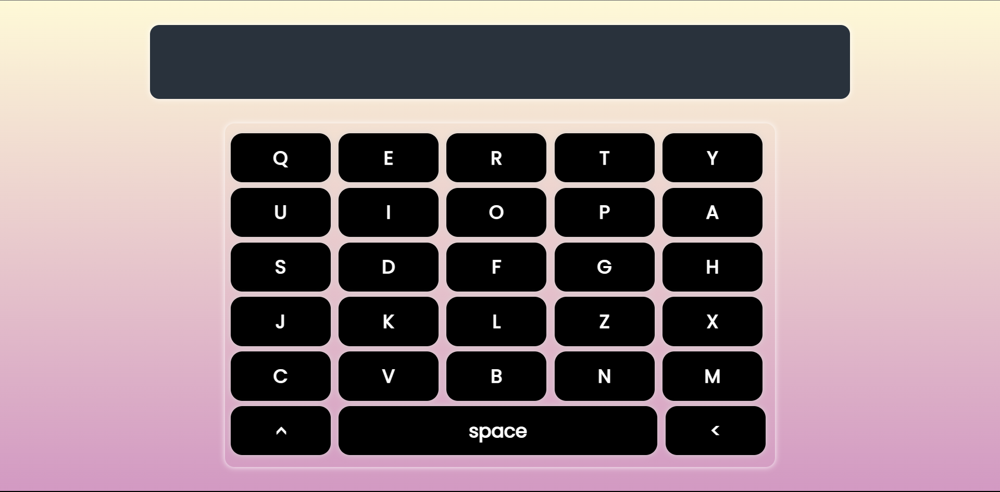

# Simple Virtual Keyboard

## Overview
This is a simple virtual keyboard project built with HTML, CSS, and JavaScript. It provides an on-screen keyboard that users can interact with by clicking the keys or by using their physical keyboard.

## Demo
You can try out the virtual keyboard by visiting the live demo here: [Virtual Keyboard Demo](https://amalrajkp18.github.io/simple-virtual-keyboard/)

